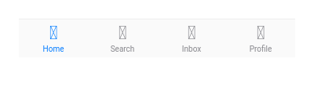
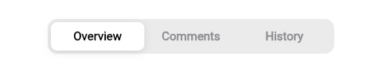
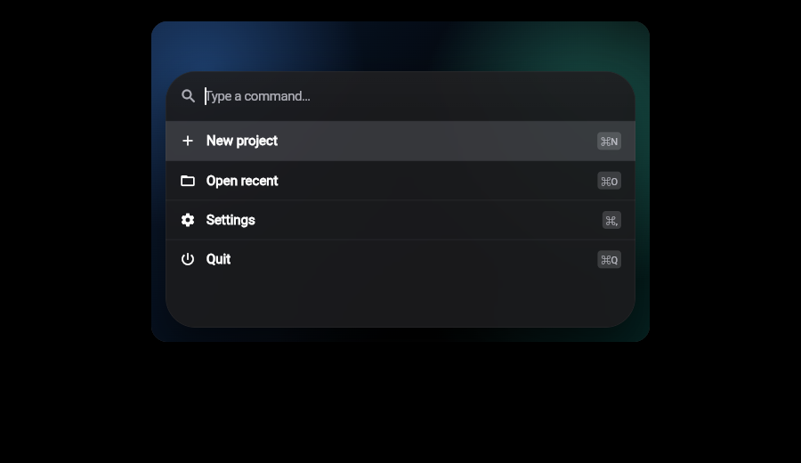
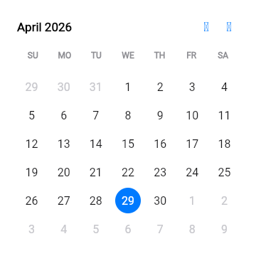

# liqkit_ui

**iOS 26 Liquid Glass design system for Flutter — 76 components, every one
with goldens, snippets, and live docs.**

A pure-Dart pub workspace under Melos. Steady-state dependencies are
Dart-only; Node/pnpm only show up under `apps/docs/` for the Fumadocs
documentation site. The component library, design tokens, asset bundle,
showcase, and snippets app all live in a single workspace.

## Links

- **Website:** <https://liqkit.com>
- **GitHub:** <https://github.com/ahmedomar365/liqkit_ui>
- **Package:** `liqkit_ui` on pub.dev once the first release is published.

## Preview

| Bottom nav | Tabs |
| --- | --- |
|  |  |

| Command palette | Calendar |
| --- | --- |
|  |  |

## Highlights

- **76 components** across 7 categories — buttons, toggles, toggle
  groups, sliders, steppers, sheets, alerts, sidebars, lists,
  popovers, menus, popup buttons, segmented controls, page controls,
  progress, text fields, textareas, pickers, color pickers, top bars,
  toolbars, bottom nav, tabs, breadcrumbs, pagination, command
  palette, tree view, status bars, notifications, skeletons, toasts,
  tooltips, hover cards, badges, app icons, bezels, keyboards, kit
  helpers, materials, widgets, windows, system, examples, face ID,
  activity views, accordion, collapsible, avatar, card, carousel,
  dialog, drawer, resizable, scroll area, data table, kanban, empty
  states, divider, label, text styles, colors, checkbox, radio, chip,
  calendar, date picker field, time picker, time field, number field,
  OTP input, combobox, line chart, bar chart, rich editor.
- **Liquid Glass** throughout — every glass-bearing component (dialog,
  drawer, card, accordion, hover card, command palette, bottom nav,
  toast info) routes through a single `LiqGlassSurface` primitive
  with proper backdrop blur, hairline rim, and vibrancy highlight,
  so surfaces correctly translucent-tint whatever sits behind them.
- **iOS-26 motion** — animations centralised in `LiqMotion`
  (`standard` / `snappy` / `smooth` curves, `fast` / `normal` /
  `slow` durations) so a future swap to true `SpringSimulation`
  curves is a one-file change.
- **SF Pro Text/Display auto-switch** — typography helper picks the
  right family by size (Apple's 20pt rule) so headlines get the
  refined Display glyphs and body copy gets Text's sturdier strokes.
- **Goldens for every component** — widget tests assert exact pixel
  dimensions and behavior in `packages/liqkit_ui/test/components/`.
- **Live docs** at `apps/docs/` (Fumadocs 16 + Next 16 + Tailwind 4)
  with Preview/Code tabs per page, ⌘K Orama search, and a snippets
  Flutter Web app iframed in for the live previews.
- **Playwright e2e** — single-page smoke (`buttons-page.spec.ts`),
  representative-pages sweep (`sample-pages.spec.ts`), Phase-4 27-page
  audit (`phase4-audit.spec.ts`), search regression
  (`search.spec.ts`).
- **Canonical tokens generated** from Figma variable-defs into typed
  Dart classes — never edited by hand.

## Layout

```
.
├── packages/
│   ├── liqkit_ui/             # the published component library
│   ├── liqkit_ui_tokens/      # generated colors + typography
│   ├── liqkit_ui_assets/      # SF Pro fonts + asset manifest
│   └── liqkit_ui_design_data/ # frozen archive from upstream liqkit
├── apps/
│   ├── docs/                  # Fumadocs Next.js docs site
│   ├── docs_snippets/         # Flutter Web app iframed by docs previews
│   ├── showcase/              # full-coverage Flutter Web demo
│   └── playground/            # ad-hoc Flutter dev sandbox
├── tooling/
│   └── gen/                   # token capture, snippet manifest, snippet codegen
└── docs/superpowers/          # specs and implementation plans
```

## Local development

```bash
# 1. Build the snippets Flutter Web app (iframed by docs)
cd apps/docs_snippets
flutter build web --wasm --release --no-web-resources-cdn --pwa-strategy=none --base-href=/

# 2. Serve it on :4174 with COOP/COEP headers for threaded skwasm
cd ../..
PORT=4174 node tooling/serve_flutter_web_with_headers.mjs apps/docs_snippets/build/web

# 3. Run the Fumadocs docs app on :3000
cd apps/docs
NEXT_PUBLIC_SNIPPETS_URL=http://localhost:4174 npx pnpm@10 dev
```

Open <http://localhost:3000>.

For hot-reloading the Flutter side, replace step 1+2 with:

```bash
cd apps/docs_snippets
flutter run -d web-server --web-port=4174
```

## Quality gates

Run before every commit:

```bash
melos run fmt
melos run analyze
melos run analyze:flutter
melos run test
melos run audit:real_previews
```

Plus, for docs-affecting changes:

```bash
cd apps/docs && pnpm e2e
```

## Adding a component

Each component follows a fixed template. See
`docs/superpowers/plans/2026-04-29-phase4a-component-parity.md` for
the bite-sized steps. In short:

1. `packages/liqkit_ui/lib/src/components/<name>/liq_<name>.dart` — the
   widget. `final class … with Diagnosticable`. Static `const` design
   constants. `debugFillProperties`.
2. `packages/liqkit_ui/lib/components.dart` — alphabetically-positioned
   export.
3. `packages/liqkit_ui/test/components/liq_<name>_test.dart` — widget
   tests covering behavior + canonical dimensions.
4. `apps/docs_snippets/lib/snippets/<kebab>/<variant>.dart` — interactive
   builders. Wrap in `Align(heightFactor: 1, child: …)`, mark the
   highlighted region with `// {@highlight} … // {@endhighlight}`.
5. Append the component entry to `tooling/gen/snippet_manifest.json`.
6. From repo root: `melos run docs:gen:routes && melos run docs:gen:snippets`.
7. `apps/docs/content/docs/<category>/<kebab>.mdx` — docs page.
8. Append the page slug to the matching
   `apps/docs/content/docs/<category>/meta.json`.

## Tokens

Canonical tokens live in `packages/liqkit_ui_design_data/` (frozen
archive) and are captured into typed Dart by:

```bash
dart run tooling/gen/capture_canonical_tokens.dart
dart run tooling/gen/generate_canonical_dart.dart
```

`packages/liqkit_ui_tokens/lib/src/` is **never edited by hand** —
it's generator output.

## License

This project is licensed under the [MIT License](LICENSE).

## Support

If you find this project useful, consider buying me a coffee:

[](https://buymeacoffee.com/ahmedomarar365)

## Acknowledgements

Built with love by Codex (majority) and Claude Code.
